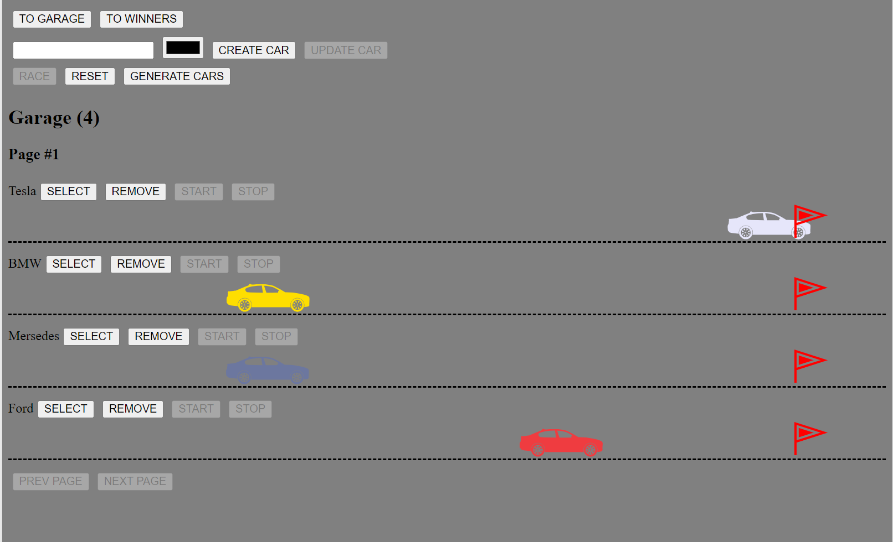

# Async-race

This project implements a simple game in which you can create, edit and delete cars, participate in races. 
Each action executes a request to the server, analyzes its response, and then one or another logic of the game is executed.

## Technology Stack:

- Fetch API 
- TypeScript
- Webpack
- ESLint

## Installation and Usage

To run this project locally, follow these steps:

1. Clone and run local server from https://github.com/SlaVR7/async-race-api repository.
2. Clone this repository.
3. Run 'npm install'.
4. Run 'npm start'.

## Screenshot

## Available Scripts

- **'npm run build':** This script triggers the Webpack bundler to build your project in production mode. It sets the Node environment to production.
- **'npm run build:dev':** This script instructs Webpack to build your project in development mode, optimizing it for development and debugging.
- **'npm run watch':** This script runs Webpack in watch mode, which continuously monitors your project files for changes and rebuilds it automatically when changes are detected.
- **'npm start':** This script starts a development server using Webpack's built-in development server, allowing you to preview and test your project locally.
- **'npm run lint':** This script runs ESLint, a code analysis tool, on the code located in the src directory of your project. It automatically fixes code style and syntax issues using the --fix option, ensuring that your code conforms to defined coding standards and maintains consistency.

